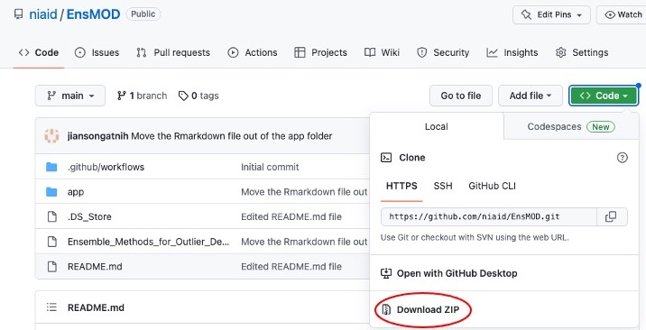

# EnsMOD

### A Software Program for Omics Sample Outlier Detection

Detection of omics sample outliers is important for preventing erroneous biological conclusions, developing robust experimental protocols, and discovering rare biological states. Two recent publications (*Chen et al 2020 & Selicato et al 2021*) describe robust algorithms for detecting transcriptomic sample outliers, but neither algorithm had been incorporated into a software tool for omics scientists. 

Here we describe our R Shiny Application for Ensemble Methods for Outlier Detection (**EnsMOD**) which incorporates both Robust PCA algorithms. **EnsMOD** also calculates how closely the quantitation variation follows a normal distribution, plots the density curves of each sample to visualize anomalies, performs hierarchical cluster analyses to calculate how closely the samples cluster with each other, and performs robust principal component analyses to statistically test if any sample is an outlier. The probabilistic threshold parameters can be easily adjusted to tighten or loosen the outlier detection stringency. 

**EnsMOD** was used to analyze a simulated proteomics dataset, a multiomic (proteome and transcriptome) dataset, a single-cell proteomics dataset, and a phosphoproteomics dataset. **EnsMOD** successfully identified all of the simulated outliers, and outlier removal improved data quality for downstream statistical analyses. 


## Prerequisites

To run **EnsMOD**, R and Rstudio should be installed and running on your machine. Instructions are available for R installation and for RStudio installation. In addition, the following R packages are also required for **EnsMOD** to work on your machine. 

```code
library(shiny)
library(shinyjs)
library(xfun)
library(DT)
library(readr)
library(dplyr)
library(data.table)
library(reshape2)
library(htmltools)
library(readxl)
library(stats)
library(rrcov)
library(cluster) 
library(limma)
library(ggraph)
library(RColorBrewer)
library(tidyverse)
library(factoextra)
library(gplots)
library(fitdistrplus)
```

## Getting Started

**EnsMOD** is run as a Shiny App from RStudio. It will also explicitly link your data with the R codes and results as a Rmarkdown html file, which can be used as a report or for presentation and sharing to facilitate your collaboration. All of the results are saved in the <i>EnsMODoutputs</i> folder (<i>~/EnsMOD/app/www/EnsMODoutpupts/</i>).  

Before you run **EnsMOD** on your own data, we provide four different sample datasets (<i>EnsMOD-Examples</i>) for you to practice with. A brief description of these sample datasets can be found <a href="./app/EnsMOD_Examples/EnsMOD_Examples_description.txt" target="_blank">here</a>. You can download them as a ZIP file <a href="https://github.com/niaid/EnsMOD/blob/main/app/EnsMOD_Examples.zip">EnsEMOD_Examples.zip</a> 


**EnsMOD** can be downloaded as a ZIP file here (<i>as shown below</i>) 

<br> or by executing the following code in a terminal. But you may need to install <i><a href="https://git-scm.com/book/en/v2/Getting-Started-Installing-Git" target="_blank">git</a></i> on you computer if you do not have it installed already. 

```code
git clone git@github.com:niaid/EnsMOD.git
```

Once downloaded from GitHub, open the <i>app.R</i> file in the <i>EnsMOD/app/</i> folder in RStudio. Clicking 'Run App' will start EnsMOD app with a Shiny popup window and then clicking 'Open in Browser' on the top of the popup window (<i>see the figure below</i>) to start. From the browser window you can test run EnsMOD app using the <i>EnsMOD_Examples</i> files. Once you run those sample data without any issues, you are ready to run EnsMOD analysis on your own data.


The results from EnsMOD analysis are presented under several tabs (<i>see below</i>) and can be found in the output folder (<i>EnsMOD/app/www/EnsMODoutputs/<i>).


## References

<ol>
	<li>Boris Iglewicz and David Hoaglin. 1993. "Volume 16: How to Detect and Handle Outliers", The ASQC Basic References in Quality Control: Statistical Techniques, Edward F. Mykytka, Ph.D., Editor. [<a href="https://hwbdocuments.env.nm.gov/Los%20Alamos%20National%20Labs/TA%2054/11587.pdf" target=_blank>PDF</a>]
	<li>Charrad, M.; Ghazzali, N.; Boiteau, V. & Niknafs, A. 2014. NbClust: An R Package for Determining the Relevant Number of Clusters in a Data Set. J Statistical Software 61:1-36. <a href="https://doi.org/10.18637/jss.v061.i06" target=_blank>DOI: 10.18637/jss.v061.i06</a>
	<li>Chen, X.; Zhang, B.; Wang, T.; Bonni, A. & Zhao, G. 2020. Robust principal component analysis for accurate outlier sample detection in RNA-Seq data. BMC Bioinformatics 21, 269. <a href="https://doi.org/10.1186/s12859-020-03608-0" target=_blank> DOI: 10.1186/s12859-020-03608-0</a>
	<li>Hubert, M.; Rousseeuw, P. J. & Branden, K. V. 2005. ROBPCA: A New Approach to Robust Principal Component Analysis, Technometrics, 47:1, 64-79, <a href="https://doi.org/10.1198/004017004000000563" target=_blank>DOI: 10.1198/004017004000000563</a>
	<li>Selicato, L.; Esposito, F.;  Gargano, G.; Vegliante, M.C.; Opinto, G.; Zaccaria, G.M.; Ciavarella, S.; Guarini, A. & Del Buono, N.  2021. A New Ensemble Method for Detecting Anomalies in Gene Expression Matrices. Mathematics 9:882. <a href="https://doi.org/10.3390/math9080882" target=_blank>DOI: 10.3390/math9080882</a>
	<li>Spiess and Neumeyer. 2010. An evaluation of R2 as an inadequate measure for nonlinear models in pharmacological and biochemical research: a Monte Carlo approach. BMC Pharmacol 10:6. <a href="https://doi.org/10.1186/1471-2210-10-6" target=_blank>DOI: 10.1186/1471-2210-10-6</a>
</ol>


## Authors

**Nathan Manes,**
**Jian Song &**
**Aleksandra Nita-Lazar**

Contact us at <a href="mailto:EnMOD-team@nih.gov">EnsMOD-team@nih.gov</a>  


